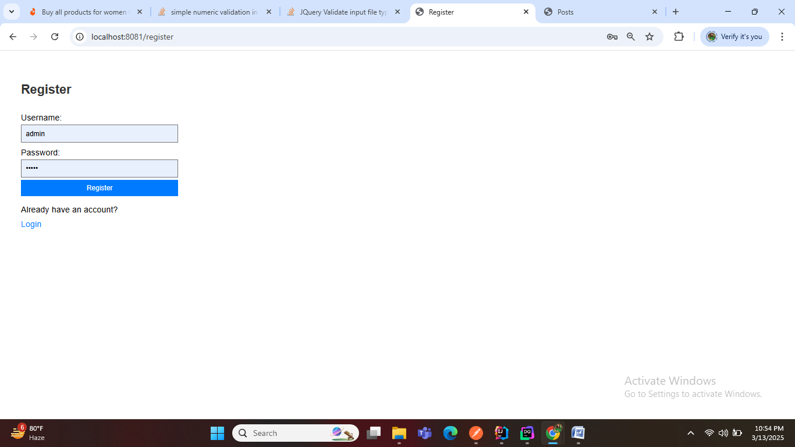
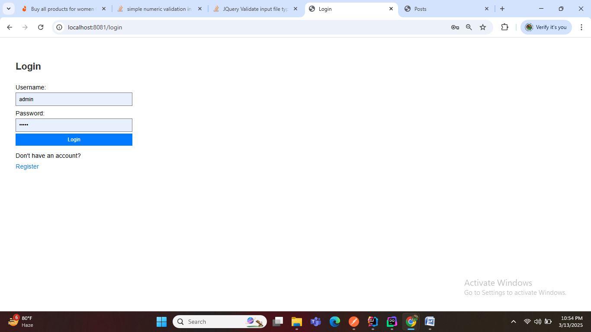
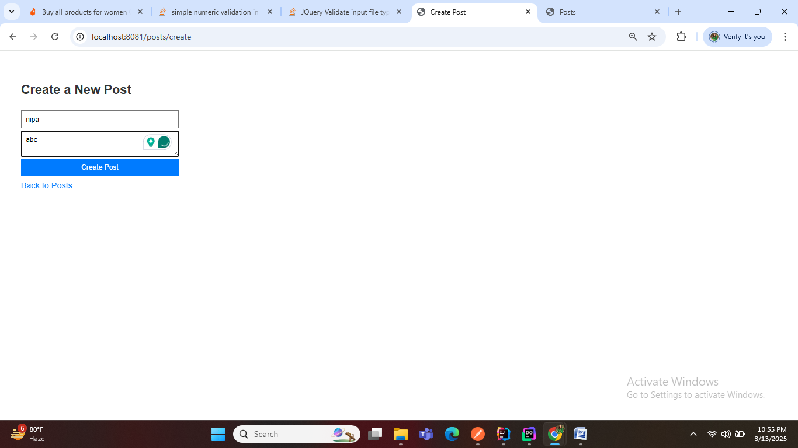
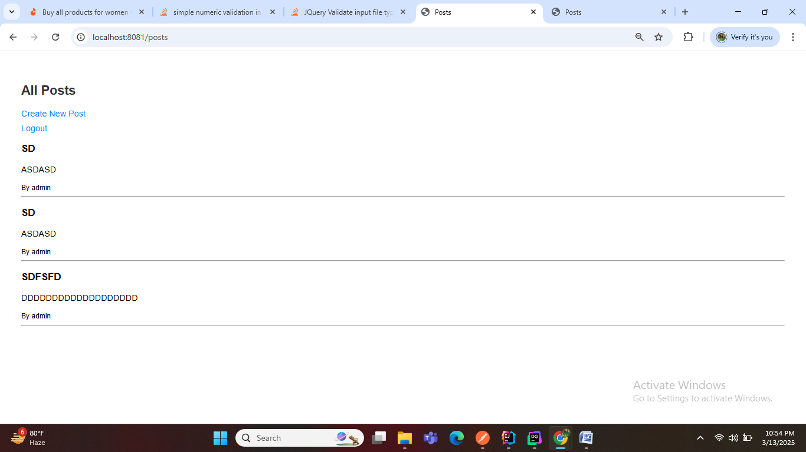

## Spring Boot Project - Secure CRUD Application
This project demonstrates a secure web application developed with Spring Boot, featuring user authentication, basic CRUD operations, and security measures addressing common vulnerabilities based on OWASP Top 10.

### Project Overview
The application provides user authentication, basic CRUD operations for a sample entity (e.g., Blog Posts), and implements the following security measures:

**SQL Injection Prevention**
Cross-Site Scripting (XSS) Protection
Cross-Site Request Forgery (CSRF) Protection
Broken Authentication & Session Management Fixes
Access Control and Authorization with Role-Based Access Control (RBAC)
Input Validation & Sanitization
Key Technologies Used
Spring Boot
Spring Security
Spring Data JPA
Thymeleaf (for templating)
BCrypt (for password hashing)
H2 Database (or any other relational database)
Features Implemented
1. User Authentication (Login & Registration)
   Login & Registration: Users can register and log in securely.

Password Hashing: The application uses BCryptPasswordEncoder to hash passwords securely before storing them in the database.

Example:

```java
@Bean
public PasswordEncoder passwordEncoder() {
return new BCryptPasswordEncoder();
}
```
Session Management: Secure session management via Spring Security to handle session timeouts and use secure cookie settings.

Example:

```
http
.sessionManagement()
.sessionCreationPolicy(SessionCreationPolicy.IF_REQUIRED)
.invalidSessionUrl("/login?invalid-session=true")
.maximumSessions(1)
.maxSessionsPreventsLogin(true);
```
2. CRUD Operations for Sample Entity (Blog Post)
   CRUD Operations: Implemented basic Create, Read, Update, Delete operations for a sample entity, BlogPost.

Repositories: Used Spring Data JPA for database operations.

Example Repository:

```java
@Repository
public interface BlogPostRepository extends JpaRepository<BlogPost, Long> {
List<BlogPost> findByTitle(String title);
} 
```
3. Security Issues Based on OWASP Top 10
   SQL Injection
   Prepared Statements: Used Spring Data JPA repositories to ensure that SQL queries are safely executed with parameters to avoid SQL injection vulnerabilities.

Example:

```java

@Query("SELECT p FROM Product p WHERE p.name = :name")
List<Product> findByName(@Param("name") String name);
```
Cross-Site Scripting (XSS)
Input Sanitization: User inputs are sanitized using Thymeleaf to automatically escape data before displaying it on views, mitigating the risk of XSS attacks.

Example in Thymeleaf template:

```html

<p th:text="${product.description}"></p> <!-- Automatically escapes any HTML -->
```
Cross-Site Request Forgery (CSRF)
CSRF Protection: Spring Security’s CSRF protection is enabled by default. If disabled previously, it is now re-enabled in the configuration.

Example in Spring Security configuration:

```java

http.csrf().enable();
```
Broken Authentication & Session Management
Password Hashing: Passwords are securely hashed using BCryptPasswordEncoder.

Example:

```java

@Autowired
private PasswordEncoder passwordEncoder;

public String encodePassword(String password) {
return passwordEncoder.encode(password);
}
```
Secure Session Management: Configured Spring Security for secure session management, enforcing session timeout, and ensuring that cookies have secure flags.

Access Control and Authorization (RBAC)
Role-Based Access Control (RBAC): Users are assigned roles (e.g., USER, ADMIN) to restrict access to certain pages.

Example:

```java

http
.authorizeRequests()
.antMatchers("/admin/**").hasRole("ADMIN")
.antMatchers("/user/**").hasAnyRole("USER", "ADMIN")
.anyRequest().authenticated();
```
Input Validation & Sanitization
Data Validation: All inputs are validated using JSR-303 annotations like @NotNull, @Size, and custom validators to ensure the data is sanitized before processing.

Example:

```java

@Entity
public class Product {
@NotNull
@Size(min = 2, max = 100)
private String name;
}
```
Sanitization: Input data is sanitized before being stored in the database.

## My application UI Screenshot shared below:

1.Register UI



2. Login UI



3. CreatePost UI



4. View All Posts


